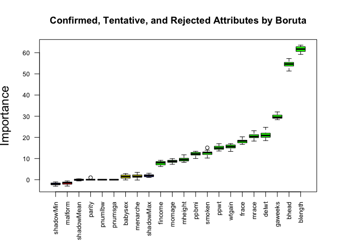
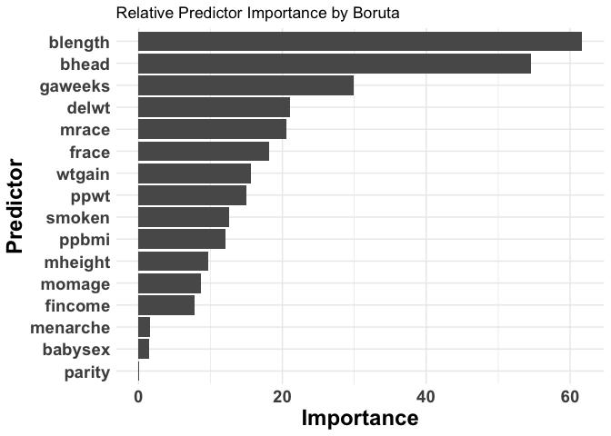
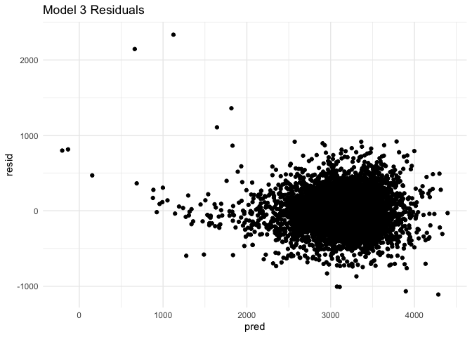
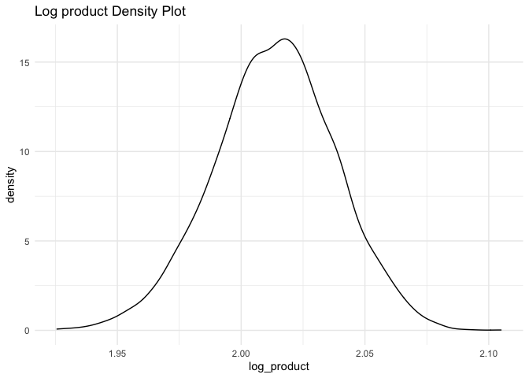

p8105\_hw6\_ll3344
================
Lusha Liang

Load packages and set plot
    theme.

``` r
library(tidyverse)
```

    ## ── Attaching packages ───────────────────────────────────────────────────────────────────────────── tidyverse 1.3.0 ──

    ## ✓ ggplot2 3.3.2     ✓ purrr   0.3.4
    ## ✓ tibble  3.0.1     ✓ dplyr   1.0.2
    ## ✓ tidyr   1.1.0     ✓ stringr 1.4.0
    ## ✓ readr   1.3.1     ✓ forcats 0.5.0

    ## ── Conflicts ──────────────────────────────────────────────────────────────────────────────── tidyverse_conflicts() ──
    ## x dplyr::filter() masks stats::filter()
    ## x dplyr::lag()    masks stats::lag()

``` r
library(modelr)
library(Boruta)
theme_set(theme_minimal() + theme(legend.position = "bottom"))
```

## Problem 1: Revisiting Homicide Data

First we read in the data and create a city\_state variable combining
city name and state name. We then create a variable called resolution,
which is a binary variable indicating whether the homicide is solved. We
omit Dallas, TX, Phoenix, AZ and Kansas City, MO since these cities do
not report victim race. We also omit Tulsa, AL as this is is a data
entry mistake. We then filter only for white and black victims as these
are the most common races represented in this dataset.

``` r
homicide_df = 
  read_csv("data/homicide_data.csv", na = c("", "NA", "Unknown")) %>% 
  mutate(
    city_state = str_c(city, state, sep = ", "),
    victim_age = as.numeric(victim_age),
    resolution = case_when(
      disposition == "Closed without arrest" ~ 0,
      disposition == "Open/No arrest"        ~ 0,
      disposition == "Closed by arrest"      ~ 1)
  ) %>% 
  filter(
    victim_race %in% c("White", "Black"),
    city_state != "Tulsa, AL") %>% 
  select(city_state, resolution, victim_age, victim_race, victim_sex)
```

    ## Parsed with column specification:
    ## cols(
    ##   uid = col_character(),
    ##   reported_date = col_double(),
    ##   victim_last = col_character(),
    ##   victim_first = col_character(),
    ##   victim_race = col_character(),
    ##   victim_age = col_double(),
    ##   victim_sex = col_character(),
    ##   city = col_character(),
    ##   state = col_character(),
    ##   lat = col_double(),
    ##   lon = col_double(),
    ##   disposition = col_character()
    ## )

For the city of Baltimore, MD, we use the glm function to fit a logistic
regression with resolved vs unresolved as the outcome and victim age,
sex and race as predictors. We then create a table showing the estimate
and confidence interval of the adjusted odds ratio for solving homicides
comparing non-white victims to white victims keeping all other variables
fixed.

``` r
baltimore_df =
  homicide_df %>% 
  filter(city_state == "Baltimore, MD")

glm(resolution ~ victim_age + victim_race + victim_sex, 
    data = baltimore_df,
    family = binomial()) %>% 
  broom::tidy() %>% 
  mutate(
    OR = exp(estimate),
    CI_lower = exp(estimate - 1.96 * std.error),
    CI_upper = exp(estimate + 1.96 * std.error)
  ) %>% 
  select(term, OR, starts_with("CI")) %>% 
  knitr::kable(digits = 3)
```

| term              |    OR | CI\_lower | CI\_upper |
| :---------------- | ----: | --------: | --------: |
| (Intercept)       | 1.363 |     0.975 |     1.907 |
| victim\_age       | 0.993 |     0.987 |     1.000 |
| victim\_raceWhite | 2.320 |     1.648 |     3.268 |
| victim\_sexMale   | 0.426 |     0.325 |     0.558 |

We then run glm for each of the cities in the dataset and create a
dataframe with estimated ORs and CIs for each city.

``` r
models_results_df = 
  homicide_df %>% 
  nest(data = -city_state) %>% 
  mutate(
    models = 
      map(.x = data, ~glm(resolution ~ victim_age + victim_race + victim_sex, data = .x, family = binomial())),
    results = map(models, broom::tidy)
  ) %>% 
  select(city_state, results) %>% 
  unnest(results) %>% 
  mutate(
    OR = exp(estimate),
    CI_lower = exp(estimate - 1.96 * std.error),
    CI_upper = exp(estimate + 1.96 * std.error)
  ) %>% 
  select(city_state, term, OR, starts_with("CI")) 
```

Finally, we created a plot that shows the estimated ORs and CIs for each
city. The plot shows that compared to black victims, white victims are
generally more likely to have their homicides solved by arrest. In
particular cities this is especially apparent (e.g. Boston, Omaha, and
Oakland).

``` r
models_results_df %>% 
  filter(term == "victim_raceWhite") %>% 
  mutate(city_state = fct_reorder(city_state, OR)) %>% 
  ggplot(aes(x = city_state, y = OR)) + 
  geom_point() + 
  geom_errorbar(aes(ymin = CI_lower, ymax = CI_upper)) + 
  theme(axis.text.x = element_text(angle = 90, hjust = 1)) + 
  ylab("Odds ratios") + 
  xlab("City_State") +
  ggtitle("Odds Ratios by City_state") 
```

<!-- -->

## Problem 2: Birthweight Models

Read in and tidy the data. There are no missing values in the data.

``` r
baby_df = 
  read_csv("./data/birthweight.csv") %>%
  mutate_at(c("babysex", "frace", "malform", "mrace"), as.factor)
```

    ## Parsed with column specification:
    ## cols(
    ##   .default = col_double()
    ## )

    ## See spec(...) for full column specifications.

``` r
baby_df %>%
  summarise_all(funs(sum(is.na(.))))
```

    ## Warning: `funs()` is deprecated as of dplyr 0.8.0.
    ## Please use a list of either functions or lambdas: 
    ## 
    ##   # Simple named list: 
    ##   list(mean = mean, median = median)
    ## 
    ##   # Auto named with `tibble::lst()`: 
    ##   tibble::lst(mean, median)
    ## 
    ##   # Using lambdas
    ##   list(~ mean(., trim = .2), ~ median(., na.rm = TRUE))
    ## This warning is displayed once every 8 hours.
    ## Call `lifecycle::last_warnings()` to see where this warning was generated.

    ## # A tibble: 1 x 20
    ##   babysex bhead blength   bwt delwt fincome frace gaweeks malform menarche
    ##     <int> <int>   <int> <int> <int>   <int> <int>   <int>   <int>    <int>
    ## 1       0     0       0     0     0       0     0       0       0        0
    ## # … with 10 more variables: mheight <int>, momage <int>, mrace <int>,
    ## #   parity <int>, pnumlbw <int>, pnumsga <int>, ppbmi <int>, ppwt <int>,
    ## #   smoken <int>, wtgain <int>

Create the first model of birthweight using only length at birth and
gestational age.

``` r
model_fit_1 = lm(bwt ~ blength + gaweeks, data = baby_df)

baby_df %>% 
  add_residuals(model_fit_1) %>% 
  add_predictions(model_fit_1) %>%
  ggplot(aes(x = pred, y = resid)) + 
  geom_point() +
  ggtitle("Model 1 Residuals")
```

<!-- -->

Create the second model of birthweight using the interaction of head
circumference, length, and sex. This plot of residuals against predicted
values demonstrates overall lower residuals than in the first
model.

``` r
model_fit_2 = lm(bwt ~ bhead * blength + bhead * babysex + blength * babysex + bhead * blength * babysex, data = baby_df)

baby_df %>% 
  add_residuals(model_fit_2) %>% 
  add_predictions(model_fit_2) %>%
  ggplot(aes(x = pred, y = resid)) + 
  geom_point() +
  ggtitle("Model 2 Residuals")
```

<!-- -->

Create a third model. We will use the Boruta package in R to select
features for our model. Boruta uses a random forest algorithm for
feature selection. The first plot generated shows predictors that were
considered significant in green, “tentative” predictors in yellow, and
rejected predictors in red. In this model, we will choose to incorporate
only attributes deemed as important as predictors in our regression
model. The second plot simply shows predictors ranked by variable
importance.

``` r
set.seed(111)
boruta = Boruta(bwt ~ ., data = baby_df, doTrace = 2, maxRuns = 20)
```

    ##  1. run of importance source...

    ##  2. run of importance source...

    ##  3. run of importance source...

    ##  4. run of importance source...

    ##  5. run of importance source...

    ##  6. run of importance source...

    ##  7. run of importance source...

    ##  8. run of importance source...

    ##  9. run of importance source...

    ##  10. run of importance source...

    ##  11. run of importance source...

    ## After 11 iterations, +1 mins:

    ##  confirmed 13 attributes: bhead, blength, delwt, fincome, frace and 8 more;

    ##  rejected 4 attributes: malform, parity, pnumlbw, pnumsga;

    ##  still have 2 attributes left.

    ##  12. run of importance source...

    ##  13. run of importance source...

    ##  14. run of importance source...

    ##  15. run of importance source...

    ##  16. run of importance source...

    ##  17. run of importance source...

    ##  18. run of importance source...

    ##  19. run of importance source...

``` r
print(boruta)
```

    ## Boruta performed 19 iterations in 1.623509 mins.
    ##  13 attributes confirmed important: bhead, blength, delwt, fincome,
    ## frace and 8 more;
    ##  4 attributes confirmed unimportant: malform, parity, pnumlbw, pnumsga;
    ##  2 tentative attributes left: babysex, menarche;

``` r
plot(boruta, las = 2, cex.axis = 0.8, cex.lab = 1.5, xlab = NULL, main = "Confirmed, Tentative, and Rejected Attributes by Boruta")
```

<!-- -->

``` r
imp = as.data.frame(attStats(boruta))
imp = data.frame(rownames(imp),imp)
colnames(imp)[1] = "variables"

imp = 
  imp %>% 
  filter(meanImp>0) %>% 
  arrange(desc(meanImp))

plot_imp = 
  imp %>% 
  ggplot(aes(x = reorder(variables,meanImp), y = meanImp)) + 
  geom_bar(stat = "identity") + 
  coord_flip() + xlab("Predictor") + ylab("Importance") +
  theme(axis.text = element_text(size=14,face="bold"), axis.title=element_text(size=18,face="bold")) +
  ggtitle("Relative Predictor Importance by Boruta")

plot_imp
```

<!-- -->

``` r
model_fit_3 = lm(bwt ~ blength + bhead + gaweeks + delwt + mrace + frace + wtgain + ppwt + smoken + mheight + momage + fincome, data = baby_df) 

baby_df %>% 
  add_residuals(model_fit_3) %>% 
  add_predictions(model_fit_3) %>%
  ggplot(aes(x = pred, y = resid)) + 
  geom_point() +
  ggtitle("Model 3 Residuals")
```

<!-- -->

The residuals plot appears similar to the plot generated from model 2.

Compare the three models using cross validation and RMSE. The plot of
rmse distributions shows that the model we created using Boruta (model
3) has the lowest RMSE on average.

``` r
cv_df = 
  crossv_mc(baby_df, 100) 

cv_df %>% pull(train) %>% .[[1]] %>% as_tibble
```

    ## # A tibble: 3,473 x 20
    ##    babysex bhead blength   bwt delwt fincome frace gaweeks malform menarche
    ##    <fct>   <dbl>   <dbl> <dbl> <dbl>   <dbl> <fct>   <dbl> <fct>      <dbl>
    ##  1 2          34      51  3629   177      35 1        39.9 0             13
    ##  2 1          34      48  3062   156      65 2        25.9 0             14
    ##  3 2          36      50  3345   148      85 1        39.9 0             12
    ##  4 1          34      52  3062   157      55 1        40   0             14
    ##  5 2          34      52  3374   156       5 1        41.6 0             13
    ##  6 2          33      46  2523   126      96 2        40.3 0             14
    ##  7 1          36      52  3515   146      85 1        40.3 0             11
    ##  8 1          33      50  3459   169      75 2        40.7 0             12
    ##  9 2          35      51  3317   130      55 1        43.4 0             13
    ## 10 1          35      51  3459   146      55 1        39.4 0             12
    ## # … with 3,463 more rows, and 10 more variables: mheight <dbl>, momage <dbl>,
    ## #   mrace <fct>, parity <dbl>, pnumlbw <dbl>, pnumsga <dbl>, ppbmi <dbl>,
    ## #   ppwt <dbl>, smoken <dbl>, wtgain <dbl>

``` r
cv_df %>% pull(test) %>% .[[1]] %>% as_tibble
```

    ## # A tibble: 869 x 20
    ##    babysex bhead blength   bwt delwt fincome frace gaweeks malform menarche
    ##    <fct>   <dbl>   <dbl> <dbl> <dbl>   <dbl> <fct>   <dbl> <fct>      <dbl>
    ##  1 1          33      52  3374   129      55 1        40.7 0             12
    ##  2 2          33      49  2778   140       5 1        37.4 0             12
    ##  3 1          35      56  3232   147      55 1        42.1 0             13
    ##  4 2          35      53  3345   127      65 2        39.7 0             14
    ##  5 2          36      56  3685   170      95 1        40.3 0             12
    ##  6 1          38      53  3799   167      75 1        39.9 0             12
    ##  7 2          33      54  3062   134      65 1        40.4 0             12
    ##  8 2          35      53  3600   141      35 1        42.3 0             14
    ##  9 2          34      51  3232   155      55 1        41.6 0             15
    ## 10 2          34      51  3175   142      96 1        42.3 0             17
    ## # … with 859 more rows, and 10 more variables: mheight <dbl>, momage <dbl>,
    ## #   mrace <fct>, parity <dbl>, pnumlbw <dbl>, pnumsga <dbl>, ppbmi <dbl>,
    ## #   ppwt <dbl>, smoken <dbl>, wtgain <dbl>

``` r
cv_df = 
  cv_df %>%
  mutate(
    train = map(train, as_tibble),
    test = map(test, as_tibble)
  )

cv_df = 
  cv_df %>%
  mutate(model_1 = map(train, ~lm(bwt ~ blength + gaweeks, data = .x)),
         model_2 = map(train, ~lm(bwt ~ bhead * blength + bhead * babysex + blength * babysex + bhead * blength * babysex, data = .x)),
         model_3 = map(train, ~lm(bwt ~ blength + bhead + gaweeks + delwt + mrace + frace + wtgain + ppwt + smoken + mheight + momage + fincome, data = .x))
         ) %>%
  mutate(
    rmse_1 = map2_dbl(.x = model_1, .y = test, ~rmse(model = .x, data = .y)),
    rmse_2 = map2_dbl(.x = model_2, .y = test, ~rmse(model = .x, data = .y)),
    rmse_3 = map2_dbl(.x = model_3, .y = test, ~rmse(model = .x, data = .y))
  )

cv_df %>% 
  select(starts_with("rmse")) %>% 
  pivot_longer(
    everything(),
    names_to = "model", 
    values_to = "rmse",
    names_prefix = "rmse_") %>% 
  mutate(model = fct_inorder(model)) %>% 
  ggplot(aes(x = model, y = rmse)) + 
  geom_violin() +
  ggtitle("RMSE distribution in each model")
```

<!-- -->

## Problem 3: Revisiting Central Park Weather Data

Load data.

``` r
weather_df = 
  rnoaa::meteo_pull_monitors(
    c("USW00094728"),
    var = c("PRCP", "TMIN", "TMAX"), 
    date_min = "2017-01-01",
    date_max = "2017-12-31") %>%
  mutate(
    name = recode(id, USW00094728 = "CentralPark_NY"),
    tmin = tmin / 10,
    tmax = tmax / 10) %>%
  select(name, id, everything())
```

    ## Registered S3 method overwritten by 'hoardr':
    ##   method           from
    ##   print.cache_info httr

    ## using cached file: /Users/lushaliang/Library/Caches/R/noaa_ghcnd/USW00094728.dly

    ## date created (size, mb): 2020-09-30 18:26:54 (7.52)

    ## file min/max dates: 1869-01-01 / 2020-09-30

Perfom boostrapping and extract r.squared and log(beta 0 \* beta 1).

``` r
bootstrap_df = 
  weather_df %>%
  bootstrap(5000, id = "strap_number") %>%
  mutate(
    models = map(.x = strap, ~lm(tmax ~ tmin, data = .x)),
    results_1 = map(models, broom::glance),
    results_2 = map(models, broom::tidy)
    ) %>%
  select(strap_number, results_1, results_2) %>%
  unnest(results_1, results_2) %>%
  pivot_wider(names_from = term, 
              values_from = estimate) %>%
  group_by(strap_number) %>%
  summarise_each(funs(first(.[!is.na(.)]))) %>%
  rename(intercept = '(Intercept)') %>%
  mutate(
    log_product = log(intercept * tmin)
    ) %>%
  select(strap_number, r.squared, intercept, tmin, log_product)
```

    ## Warning: unnest() has a new interface. See ?unnest for details.
    ## Try `df %>% unnest(c(results_1, results_2))`, with `mutate()` if needed

    ## Warning: `summarise_each_()` is deprecated as of dplyr 0.7.0.
    ## Please use `across()` instead.
    ## This warning is displayed once every 8 hours.
    ## Call `lifecycle::last_warnings()` to see where this warning was generated.

Plot estimates.

``` r
# r.squared density plot

bootstrap_df %>%
  ggplot(aes(x = r.squared)) +
  geom_density() +
  ggtitle("R Squared Density Plot")
```

<!-- -->

``` r
# log_product density plot

bootstrap_df %>%
  ggplot(aes(x = log_product)) +
  geom_density() +
  ggtitle("Log product Density Plot")
```

<!-- -->

Both plots appear fairly normally distributed. The plot of r.squared is
slightly left skewed.

  - The 95% confidence interval for r.squared is between 0.893461,
    0.9268232.
  - The 95% confidence interval for log\_product is between 1.9632872,
    2.0606733.
